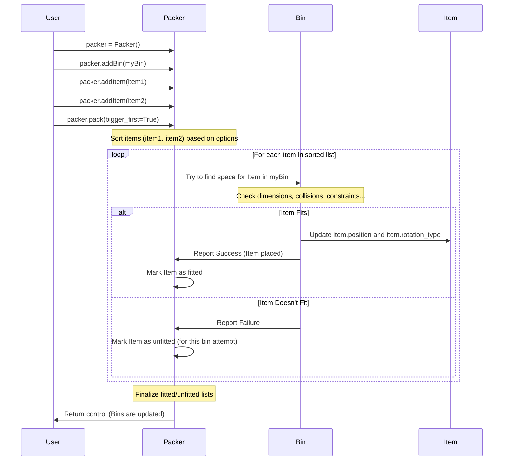

# Chapter 1: Packer Engine

Welcome to the `3D-bin-packing` tutorial! Imagine you have a bunch of items of different sizes and a set of empty boxes (or bins). How do you fit as many items as possible into these boxes, using the space efficiently? Doing this manually can be tricky and time-consuming, especially in 3D! This is where the `3D-bin-packing` library comes in, and at its heart is the **Packer Engine**.

Think of the Packer Engine like a skilled warehouse manager or a really smart Tetris player. You give it a list of available boxes ([Bins](03_bin_representation_.md)) and a list of items ([Items](02_item_representation_.md)) you need to pack. The Packer Engine then uses a set of rules and strategies (the packing algorithm) to figure out where each item should go inside the bins.

**What does it do?**

*   **Takes Inputs:** It needs to know about the bins (their dimensions, weight capacity) and the items (their dimensions, weight, and maybe other properties).
*   **Applies Logic:** It decides the order in which to pack items (e.g., should it pack the biggest items first?). It figures out the best position and orientation for each item within a bin.
*   **Manages Strategy:** It handles options like whether to try and fill one bin completely before moving to the next, or distribute items more evenly across multiple bins.
*   **Produces Output:** The result is a set of bins, now containing items placed at specific positions and orientations. It also tells you which items, if any, couldn't fit.

## Getting Started: Using the Packer

Let's see the Packer Engine in action with a very simple example. Our goal is to pack a few items into one box.

1.  **Import necessary classes:** We need `Packer`, `Bin`, and `Item`.
2.  **Create a Packer:** This is our main orchestrator.
3.  **Define a Bin:** Tell the packer what kind of box we have.
4.  **Define Items:** List the items we want to pack.
5.  **Add Bin and Items to Packer:** Give the packer the box and items.
6.  **Pack!** Tell the packer to perform the packing calculation.
7.  **Check Results:** See which items were successfully packed.

Here's the basic code structure:

```python
# 1. Import necessary classes
from py3dbp import Packer, Bin, Item

# 2. Create a Packer instance
packer = Packer()

# 3. Define a Bin (our box)
# Bin('name', (width, height, depth), max_weight, ...)
# We'll learn more about Bins in Chapter 3
box = Bin('MyBox', (10, 10, 10), 100)

# 4. Define some Items
# Item('name', ..., (width, height, depth), weight, ...)
# We'll learn more about Items in Chapter 2
item1 = Item('Item1', 'cube', 'cube', (5, 5, 5), 10, 1, 100, True, 'red')
item2 = Item('Item2', 'cube', 'cube', (5, 5, 5), 10, 1, 100, True, 'blue')
item3 = Item('Item3', 'cube', 'cube', (5, 5, 5), 10, 1, 100, True, 'green') # This one might not fit!

# 5. Add the Bin and Items to the Packer
packer.addBin(box)
packer.addItem(item1)
packer.addItem(item2)
packer.addItem(item3)

# 6. Tell the Packer to pack
packer.pack(
    bigger_first=True, # Try packing bigger items first
    distribute_items=False # Try to fill one bin completely
)

# 7. Check the results (simplified)
print(f"Bin: {box.partno}")
print("Fitted Items:")
for item in box.items:
    print(f"- {item.partno} at position {item.position}")

print("\nUnfitted Items:")
for item in box.unfitted_items:
    print(f"- {item.partno}")

# You can also access unfitted items directly from the packer
# print("\nUnfitted items (from packer):")
# for item in packer.unfit_items:
#    print(f"- {item.partno}")
```

**Explanation:**

*   We create a `Packer` object. This object holds the bins and items and contains the logic for packing.
*   We create a `Bin` object representing a 10x10x10 box that can hold 100 units of weight. More details on this in [Bin Representation](03_bin_representation_.md).
*   We create three identical 5x5x5 `Item` objects. More details on this in [Item Representation](02_item_representation_.md).
*   We use `packer.addBin()` and `packer.addItem()` to register our box and items with the packer.
*   The magic happens in `packer.pack()`. This method runs the packing algorithm.
    *   `bigger_first=True`: This tells the packer to sort the items by size (volume) and try to place the largest ones first. This is often a good strategy, like putting large rocks in a jar before pebbles.
    *   `distribute_items=False`: If we had multiple bins, this tells the packer to try and fill the current bin as much as possible before using the next one. If set to `True`, it might place some items in the first bin and some in the second, even if the first isn't full.
*   After `pack()` finishes, the `box` object (and any other bins added) will be updated. Its `items` list contains the items that were successfully placed, including their final `position` and `rotation_type`. Its `unfitted_items` list contains items assigned to this bin that couldn't fit. The `packer` also keeps a list of all unfitted items across all bins in `packer.unfit_items`.

Running this code would likely show that `Item1` and `Item2` fit, but `Item3` does not, because two 5x5x5 cubes take up the whole 10x10x10 volume (assuming they are placed side-by-side appropriately).

## Under the Hood: How Packing Works (High-Level)

When you call `packer.pack()`, several things happen behind the scenes:

1.  **Preparation:** The packer gets ready, noting the bins and items you've added. It also considers the options you provided (like `bigger_first`).
2.  **Sorting (Optional):** If `bigger_first=True`, it sorts the items, usually from largest volume to smallest. Other sorting criteria (like priority levels) might also be applied.
3.  **Iteration:** The packer goes through the sorted list of items one by one.
4.  **Placement Attempt:** For each item, it tries to find a suitable place to put it inside one of the available bins. This involves:
    *   Checking dimensions: Can the item even potentially fit?
    *   Checking orientation: Can the item be rotated to fit? (See [Item Rotation](06_item_rotation_.md))
    *   Checking for collisions: Does the chosen spot overlap with items already placed?
    *   Checking constraints: Does adding the item exceed the bin's weight limit? Are stability rules met? (See [Packing Constraints & Features](05_packing_constraints___features_.md))
5.  **Placement:** If a valid spot is found, the packer records the item's position and orientation within the bin and marks that space as occupied.
6.  **Handling Unfitted Items:** If an item cannot be placed in any available bin after trying valid positions and rotations, it's marked as "unfitted".
7.  **Repeat:** The packer continues this process until all items have been either placed or marked as unfitted.

Here's a simplified diagram showing the flow:



## Code Structure: The `Packer` Class

The core logic resides in the `Packer` class within the `py3dbp/main.py` file. Let's look at its key parts:

```python
# File: py3dbp/main.py

# ... other imports ...

class Packer:

    def __init__(self):
        ''' Simple initialization '''
        self.bins = []          # List to hold Bin objects
        self.items = []         # List to hold Item objects to be packed
        self.unfit_items = []   # List to hold items that couldn't fit anywhere
        self.total_items = 0    # Counter for added items
        self.binding = []       # For advanced grouping (see later chapters)
        # self.apex = []        # Not typically used directly by beginners

    def addBin(self, bin):
        ''' Adds a Bin object to the packer's list of bins '''
        return self.bins.append(bin)

    def addItem(self, item):
        ''' Adds an Item object to the packer's list of items '''
        self.total_items = len(self.items) + 1
        return self.items.append(item)

    def pack(self, bigger_first=False, distribute_items=True, fix_point=True, check_stable=True, support_surface_ratio=0.75, binding=[], number_of_decimals=DEFAULT_NUMBER_OF_DECIMALS):
        ''' The main packing method '''
        # ... (set number_of_decimals for bins and items) ...

        self.binding = binding # Store binding constraints

        # Sort Bins (optional, based on bigger_first for volume)
        self.bins.sort(key=lambda bin: bin.getVolume(), reverse=bigger_first)

        # Sort Items based on multiple criteria
        # 1. Volume (bigger_first)
        self.items.sort(key=lambda item: item.getVolume(), reverse=bigger_first)
        # 2. Load bearing capacity (higher first)
        self.items.sort(key=lambda item: item.loadbear, reverse=True)
        # 3. Priority Level (lower number first)
        self.items.sort(key=lambda item: item.level, reverse=False)

        # ... (Handle binding sort if needed) ...

        # Loop through each bin
        for idx, bin in enumerate(self.bins):
            # Try to pack each item into the current bin
            items_to_pack = self.items # Start with all items (or remaining if distribute_items=True)
            for item in items_to_pack:
                # pack2Bin does the heavy lifting of trying to fit the item
                self.pack2Bin(bin, item, fix_point, check_stable, support_surface_ratio)

            # ... (Handle re-packing if binding is complex) ...

            # Calculate gravity distribution for the bin (optional feature)
            self.bins[idx].gravity = self.gravityCenter(bin)

            # If distributing items, remove fitted items from the main list
            if distribute_items:
                # Logic to remove items fitted in 'bin' from 'self.items'
                # so they aren't packed into the next bin.
                # (Simplified explanation)
                fitted_partnos = {bitem.partno for bitem in bin.items}
                self.items = [item for item in self.items if item.partno not in fitted_partnos]


        # After trying all bins, collect any remaining items as unfit
        if self.items != []:
            self.unfit_items.extend(self.items) # Add remaining items to unfit list
            self.items = [] # Clear the list of items to pack

        # Arrange the order items appear within each bin's list (optional)
        self.putOrder()
```

**Key Takeaways from the Code:**

*   The `Packer` keeps separate lists for `bins`, `items` to be packed, and `unfit_items`.
*   `addBin` and `addItem` are simple methods to populate these lists.
*   The `pack` method orchestrates the process:
    *   It sorts bins and items based on criteria like size (`bigger_first`), `loadbear`, and `level`.
    *   It iterates through each `bin`.
    *   Inside the bin loop, it iterates through the `items` list (or the remaining items if `distribute_items=True`).
    *   It calls `pack2Bin` (a helper method, not shown in full detail here) for each item-bin pair. This helper method contains the complex logic for finding a valid position and rotation. We'll explore this more in [Packing Algorithm & Placement Logic](04_packing_algorithm___placement_logic_.md).
    *   If `distribute_items` is true, it removes items that were successfully packed into the current bin from the main `self.items` list so they aren't considered for subsequent bins.
    *   Finally, it collects any items still in `self.items` after all bins are processed and adds them to `self.unfit_items`.

## Conclusion

The Packer Engine (`Packer` class) is the central coordinator in the `3D-bin-packing` library. It takes your defined bins and items, applies sorting and placement logic based on the options you provide, and determines the final arrangement of items within the bins. Think of it as the brain of the operation, managing the overall strategy to solve the 3D packing puzzle.

To effectively use the Packer Engine, you first need to know how to describe the things you want to pack. In the next chapter, we'll dive into exactly that: how to represent the individual items.

Next: [Chapter 2: Item Representation](02_item_representation_.md)

---

Generated by [AI Codebase Knowledge Builder](https://github.com/The-Pocket/Tutorial-Codebase-Knowledge)