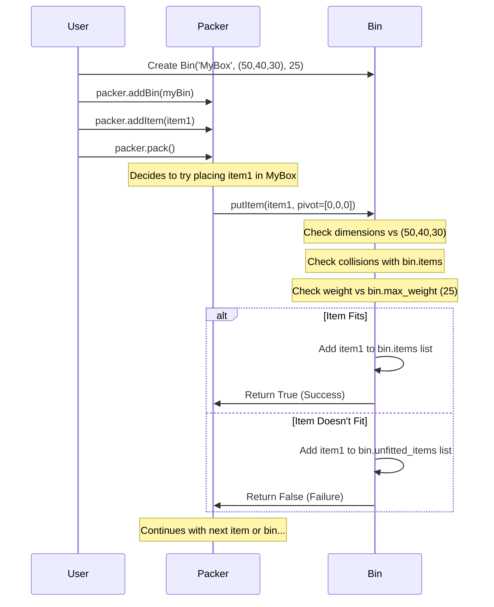

# Chapter 3: Bin Representation

Welcome back! In [Chapter 2: Item Representation](02_item_representation_.md), we learned how to describe the individual items we want to pack using the `Item` class. We defined their size, weight, shape, and handling rules. Now, we need to define the *containers* where these items will go. This is where **Bin Representation** comes in.

Imagine you're packing those items we defined earlier. You can't just pack them into thin air! You need a box, a crate, a truck, or a shipping container. In the `3D-bin-packing` library, we call this container a "Bin".

## What is a Bin?

A `Bin` object represents the three-dimensional space you are trying to fill. Think of it as the digital blueprint for your shipping container, cardboard box, or warehouse shelf. This blueprint holds the crucial details about the container itself:

*   **Size:** How big is the container? (Width, Height, Depth)
*   **Capacity:** How much total weight can it hold?
*   **Features (Optional):** Does it have special characteristics, like reinforced corners where items can't be placed?

By creating a `Bin` object, you tell the [Packer Engine](01_packer_engine_.md) the exact dimensions and limitations of the space it needs to work with.

## Creating a Bin: The Blueprint

Let's create a blueprint for a standard shipping box using the `Bin` class.

```python
# Make sure you import the Bin class (along with others we might use)
from py3dbp import Bin, Packer, Item

# Create a Bin object
# Bin('part_number', (Width, Height, Depth), max_weight, corner_size, put_type)

shipping_box = Bin(
    partno='StandardBox-A',  # A unique name or ID for this type of bin
    WHD=(50, 40, 30),        # Dimensions: (Width, Height, Depth) in cm
    max_weight=25,           # Maximum weight capacity in kg
    corner=0,                # Size of corner reservations (0 means none)
    put_type=1               # Placement order type (1=general, 2=open-top)
)

# You can print the bin's details
print(shipping_box.string()) 
```

**Explanation of Parameters:**

*   `partno` (string): A name or identifier for the bin. This helps you know which bin is which if you use multiple bins.
*   `WHD` (tuple of numbers): The **internal dimensions** of the bin: **(Width, Height, Depth)**. Use consistent units (e.g., cm, inches) for all bins and items. This defines the usable packing space.
*   `max_weight` (number): The maximum total weight of items the bin can hold. Use consistent units (e.g., kg, lbs). The [Packer Engine](01_packer_engine_.md) will ensure the sum of the weights of the packed items doesn't exceed this limit.
*   `corner` (number, optional): Defines the size of reserved spaces at the 8 corners of the bin. If `corner=15` (and units are cm), it means a 15x15x15 cube at each corner is unavailable for packing. This simulates container corner fittings. `0` means no corners are reserved. (See [Packing Constraints & Features](05_packing_constraints___features_.md)).
*   `put_type` (integer, optional): Affects the order in which items are listed in the final result, simulating loading strategy. `1` is for general loading (like through a side door), `2` simulates loading from an open top. This doesn't change *if* items fit, only the reported order. (See [Packing Constraints & Features](05_packing_constraints___features_.md)).

Running `print(shipping_box.string())` would output something like:

```
StandardBox-A(50x40x30, max_weight:25) vol(60000)
```

This confirms the bin's properties: its name, dimensions, weight capacity, and calculated volume.

## Using Bins with the Packer

Just like we added items, we need to tell the `Packer` about the bins we have available.

```python
# (Assuming Item class is imported)
from py3dbp import Packer, Bin, Item 

# 1. Create a Packer
packer = Packer()

# 2. Define a Bin (our shipping box)
shipping_box = Bin('StandardBox-A', (50, 40, 30), 25, corner=0, put_type=1)

# 3. Define some Items (from Chapter 2)
item1 = Item('Book1', 'Book', 'cube', (15, 5, 20), 2, 1, 5, True, 'red')
item2 = Item('MugBox', 'Mug', 'cube', (10, 10, 10), 1, 1, 0, False, 'blue')
heavy_item = Item('Weights', 'Weights', 'cube', (20, 20, 20), 30, 1, 100, True, 'grey') # Too heavy!

# 4. Add the Bin to the Packer
packer.addBin(shipping_box)

# 5. Add Items to the Packer
packer.addItem(item1)
packer.addItem(item2)
packer.addItem(item3) # This item won't fit due to weight

# 6. Pack!
packer.pack(
    bigger_first=True,
    distribute_items=False # Try to fill this one bin
) 

# 7. Check results (The 'shipping_box' object is updated)
print(f"--- Results for Bin: {shipping_box.partno} ---")
print("Fitted Items:")
for item in shipping_box.items:
    print(f"- {item.partno} at {item.position}")

print("\nUnfitted Items (in this Bin):") # Items assigned but couldn't fit
for item in shipping_box.unfitted_items:
    print(f"- {item.partno}")
    
print("\nUnfitted Items (Overall):") # Items that couldn't fit in *any* bin
for item in packer.unfit_items:
    print(f"- {item.partno}")
```

**What happens here?**

1.  We create our `Packer`.
2.  We define our `shipping_box` using the `Bin` class.
3.  We define a few `Item` objects. Note that `heavy_item` weighs 30 kg, which is more than the bin's `max_weight` of 25 kg.
4.  Crucially, we use `packer.addBin(shipping_box)` to tell the packer that this bin is available for packing. You can add multiple different bins if needed!
5.  We add the items using `packer.addItem()`.
6.  When `packer.pack()` runs, it considers the `shipping_box` (because we added it). It tries to place `item1` and `item2`. It will likely find they fit within the 50x40x30 dimensions and their combined weight (2 + 1 = 3 kg) is well below the 25 kg limit.
7.  When the packer tries to place `heavy_item`, it might find space dimensionally, but it will check if adding its weight (30 kg) exceeds the bin's `max_weight`. Since 3 kg (already packed) + 30 kg > 25 kg, the item cannot be placed in this bin due to the weight constraint.
8.  The results show `item1` and `item2` in `shipping_box.items`, while `heavy_item` will end up in `shipping_box.unfitted_items` and also in `packer.unfit_items`.

## Under the Hood: The `Bin` Class

The `Bin` class, like the `Item` class, primarily acts as a container for its properties and the results of the packing process. It's defined in `py3dbp/main.py`.

Here's a simplified look at its `__init__` method:

```python
# File: py3dbp/main.py (Simplified view)
import numpy as np # Used for internal tracking

class Bin:
    # This function runs when you create a Bin: Bin(...)
    def __init__(self, partno, WHD, max_weight, corner=0, put_type=1):
        ''' Store the properties passed in '''
        self.partno = partno        # Bin's identifier
        self.width = WHD[0]         # Get Width
        self.height = WHD[1]        # Get Height
        self.depth = WHD[2]         # Get Depth
        self.max_weight = max_weight # Max weight capacity
        self.corner = corner        # Corner reservation size
        self.put_type = put_type    # Item placement order type

        # Internal lists to store results after packing
        self.items = []             # List of Item objects successfully packed in this bin
        self.unfitted_items = []    # List of Item objects assigned to this bin but couldn't fit
        
        # Internal tracker for occupied space (more advanced)
        # Stores regions [x_start, x_end, y_start, y_end, z_start, z_end]
        # Starts with the floor of the bin being "occupied" at z=0 to provide a base
        self.fit_items = np.array([[0, WHD[0], 0, WHD[1], 0, 0]]) 

        # Other internal settings used during packing
        self.number_of_decimals = 0 # Default formatting
        self.fix_point = False      # Option for gravity fix (set by Packer)
        self.check_stable = False   # Option for stability check (set by Packer)
        self.support_surface_ratio = 0 # Option for stability check (set by Packer)
        self.gravity = []           # Stores gravity distribution results
        
    def string(self):
        ''' Returns a readable string representation of the bin '''
        return "%s(%sx%sx%s, max_weight:%s) vol(%s)" % (
            self.partno, self.width, self.height, self.depth, self.max_weight,
            self.getVolume()
        )

    def getVolume(self):
        ''' Calculates the bin's total volume '''
        # (Decimal formatting might be applied here)
        return self.width * self.height * self.depth

    def getTotalWeight(self):
        ''' Calculates the total weight of items currently in the bin '''
        total_weight = 0
        for item in self.items:
            total_weight += item.weight
        # (Decimal formatting might be applied here)
        return total_weight

    def putItem(self, item, pivot, axis=None):
        ''' Tries to place an item at a given pivot point. 
            This is a complex method called by the Packer.
            It checks dimensions, weight, rotation, and collisions.
            Returns True if successful, False otherwise. 
            (More details in Chapter 4) '''
        # ... (complex logic inside) ...
        # 1. Check all possible rotations for the item.
        # 2. For each rotation:
        #    a. Check if dimensions fit within the bin from the pivot point.
        #    b. Check for collisions with already placed items (using self.items or self.fit_items).
        #    c. Check if adding item.weight exceeds self.max_weight.
        #    d. Apply stability/gravity rules if self.fix_point or self.check_stable is True.
        # 3. If a valid position/rotation is found:
        #    a. Update item.position and item.rotation_type.
        #    b. Add the item to self.items.
        #    c. Update self.fit_items (internal tracker).
        #    d. Return True.
        # 4. If no valid position/rotation found, return False.
        
        # Simplified placeholder - actual logic is much more involved
        print(f"Bin '{self.partno}' attempting to place '{item.partno}' at {pivot}...")
        # In reality, this method does many checks before deciding 'fit'
        fit = False # Assume it doesn't fit initially
        # ... perform checks ...
        if fit :
             self.items.append(item) # Add to list if it fits
        return fit # Return True or False

    # ... other helper methods like checkDepth, checkWidth, checkHeight, addCorner ...

```

**Key Takeaways:**

*   The `Bin` object stores its defining characteristics (`width`, `height`, `depth`, `max_weight`, `corner`).
*   It keeps track of which `Item` objects are successfully packed inside it in the `self.items` list.
*   It also keeps a list (`self.unfitted_items`) of items that were attempted in this bin but failed to fit (due to space, weight, or other constraints).
*   The core logic for *trying* to place an item (`putItem`) resides within the `Bin` class, but it's invoked and managed by the [Packer Engine](01_packer_engine_.md). This method handles the complex checks for rotation, collision, weight, and stability.

Here's a simplified diagram showing how the `Packer` uses the `Bin`:



## Conclusion

The `Bin` class is essential for defining the containers you want to pack. By specifying its dimensions (`WHD`), maximum weight capacity (`max_weight`), and optional features like `corner` reservations, you provide the necessary boundaries and constraints for the packing process. The `Packer` uses this information, along with the `Item` details, to figure out the optimal placement. The `Bin` object itself is updated during packing to hold the list of successfully placed items.

Now that we understand how to represent both the items ([Item Representation](02_item_representation_.md)) and the containers (`Bin` Representation), we're ready to look at the core logic that puts them together: the packing algorithm itself.

Next: [Chapter 4: Packing Algorithm & Placement Logic](04_packing_algorithm___placement_logic_.md)

---

Generated by [AI Codebase Knowledge Builder](https://github.com/The-Pocket/Tutorial-Codebase-Knowledge)