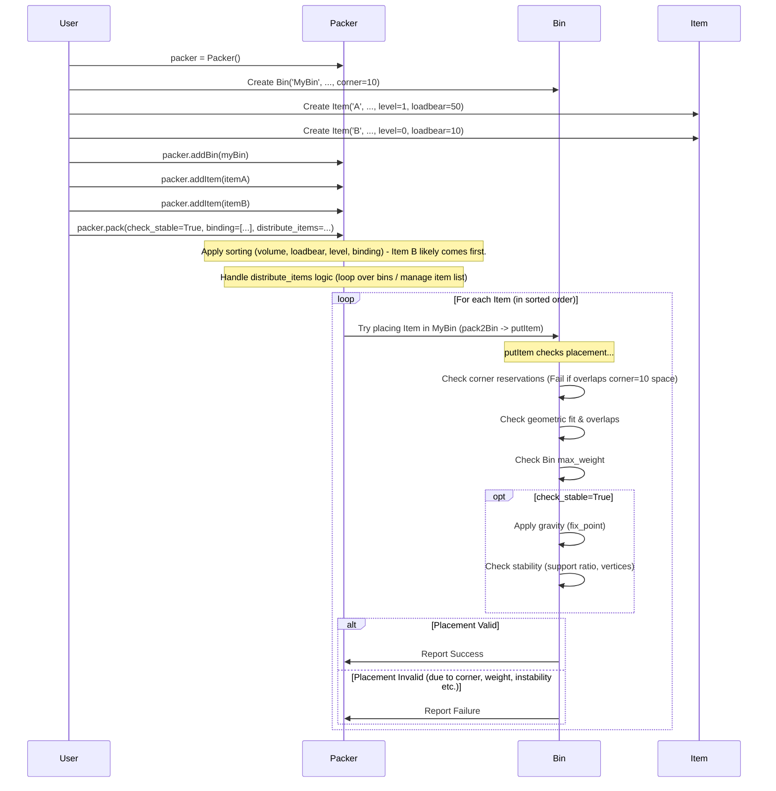

# Chapter 5: Packing Constraints & Features

Welcome back! In [Chapter 4: Packing Algorithm & Placement Logic](04_packing_algorithm___placement_logic_.md), we saw how the packer cleverly finds spots for items, avoiding overlaps and respecting basic gravity using `fix_point`. That's great for simple packing, but real-world packing often has more rules!

Imagine you're packing a moving truck. You wouldn't just throw everything in until it's full. You'd probably:
*   Put heavy furniture at the bottom, not on top of fragile boxes.
*   Make sure tall lamps are stable and won't easily tip over.
*   Keep all the parts of your disassembled bookshelf together.
*   Maybe prioritize packing essential items first.
*   Decide if you need to use a second truck for leftover items.

These extra rules and considerations are exactly what **Packing Constraints & Features** are all about in `3D-bin-packing`. They allow you to add more realism and control to the packing process. Let's explore some of the most useful ones!

## 1. Item Stability (`check_stable`, `support_surface_ratio`)

**Concept:** We want items to be placed stably, not teetering precariously on an edge.

**How it works:** In [Chapter 4](04_packing_algorithm___placement_logic_.md), we saw `fix_point=True` makes items drop down. `check_stable=True` goes a step further. When enabled, the packer checks *how much* of an item's bottom surface is supported by what's underneath.

*   `check_stable=True`: Turns on the stability check. (Requires `fix_point=True`).
*   `support_surface_ratio=0.75` (Example): This tells the packer that at least 75% of the item's bottom must be supported. If it's less supported than this ratio, the packer might reject the placement as unstable. It also checks if the item's bottom corners are hanging in the air.

**Analogy:** Making sure a dinner plate is mostly on the table, not just barely touching the edge.

**Example Code:**

```python
from py3dbp import Packer, Bin, Item

# --- Setup ---
packer = Packer()
box = Bin('StableBin', (10, 10, 10), 100)
packer.addBin(box)

# Item that needs support
item_wide = Item('WideThing', 'cube', 'cube', (8, 8, 2), 5, 1, 100, True, 'green') 
# Item that provides small support
item_narrow = Item('NarrowBase', 'cube', 'cube', (2, 2, 5), 5, 1, 100, True, 'blue')

packer.addItem(item_narrow) # Add the base first
packer.addItem(item_wide)   # Try to place the wide item on top

# --- Pack with Stability Check ---
packer.pack(
    bigger_first=False, # Pack narrow base first for this example
    fix_point=True,         # MUST be True for stability check
    check_stable=True,      # << Enable stability check
    support_surface_ratio=0.5 # << Require at least 50% support
)

# --- Check Results ---
print(f"--- {box.partno} Results ---")
for item in box.items:
    print(f"- Fitted: {item.partno} at {item.position}")
for item in box.unfitted_items:
    print(f"- Unfitted: {item.partno}") 
# Depending on exact placement, item_wide might be unfitted if it can't 
# achieve 50% support on item_narrow. Try changing the ratio!
```

**Explanation:**
By setting `check_stable=True` and `support_surface_ratio=0.5`, we tell the packer to be picky. If `item_wide` tries to sit on `item_narrow`, the packer calculates the support area. Since `item_narrow` (2x2 = 4 area) is much smaller than `item_wide`'s base (8x8 = 64 area), the support ratio would be very low (4/64 = 6.25%), much less than our required 50%. Therefore, this placement would likely be rejected, and `item_wide` might end up unfitted.

*(See `example5.py` and `example6.py` in the project for detailed stability demos).*

## 2. Item Load-Bearing Capacity (`loadbear`)

**Concept:** Prevent heavy items from being placed on top of items that can't support their weight.

**How it works:** Remember the `loadbear` property when defining an [Item](02_item_representation_.md)?
```python
# Item('partno', 'name', 'type', WHD, weight, level, loadbear, updown, color)
fragile_item = Item('GlassVase', 'vase', 'cube', (5,5,10), 2, 1, 0, False, 'cyan') # loadbear=0
sturdy_box = Item('WoodCrate', 'crate', 'cube', (10,10,10), 20, 1, 50, True, 'brown') # loadbear=50
```
Here, `fragile_item` can bear `0` weight on top of it, while `sturdy_box` can support `50` units of weight.

The packer uses this information implicitly, mainly in two ways:
1.  **Sorting:** The `Packer` automatically sorts items by `loadbear` (highest first) *before* sorting by `level` or `volume`. This naturally tries to place stronger items lower down.
2.  **Stability Checks (Advanced):** While not explicitly documented as a primary check in the basic algorithm, a robust implementation *could* factor this in during placement: "Can the item(s) below me support my weight?" This library focuses more on the *geometric* stability (tipping) via `check_stable`. The primary way `loadbear` influences stacking order is through the initial sort.

**Analogy:** Putting heavy books in the bottom of a box and lighter clothes on top.

**Using it:** Simply define the `loadbear` value correctly when creating your `Item` objects. The packer's default sorting takes care of trying to place high-loadbear items earlier (likely lower).

```python
# In Packer.pack method (see Chapter 1 code):
# Items are sorted, considering loadbear:
# self.items.sort(key=lambda item: item.getVolume(), reverse=bigger_first)
# self.items.sort(key=lambda item: item.loadbear, reverse=True) # << Higher loadbear first
# self.items.sort(key=lambda item: item.level, reverse=False) 
```

## 3. Item Priority (`level`)

**Concept:** Ensure certain items are packed before others, regardless of size. Useful for essential or high-priority goods.

**How it works:** Use the `level` property when defining an [Item](02_item_representation_.md). Lower numbers mean higher priority (packed earlier).
```python
# Item('partno', 'name', 'type', WHD, weight, level, loadbear, updown, color)
urgent_item = Item('Medicine', 'meds', 'cube', (3,3,3), 0.5, 0, 0, False, 'red')   # level=0 (Highest priority)
normal_item = Item('Books', 'book', 'cube', (10,8,5), 5, 1, 20, True, 'blue')      # level=1 (Normal priority)
optional_item = Item('Poster', 'post', 'cube', (2,2,30), 0.1, 5, 0, True, 'yellow') # level=5 (Lowest priority)
```
The packer sorts items by `level` (lowest first) after sorting by `loadbear` and `volume`.

**Analogy:** Packing your passport and wallet before packing souvenirs.

**Using it:** Assign appropriate `level` numbers to your items.

```python
# In Packer.pack method (see Chapter 1 code):
# Items are sorted, considering level:
# self.items.sort(key=lambda item: item.getVolume(), reverse=bigger_first)
# self.items.sort(key=lambda item: item.loadbear, reverse=True) 
# self.items.sort(key=lambda item: item.level, reverse=False) # << Lower level number first
```

## 4. Container Corners (`corner`)

**Concept:** Reserve space at the corners of the bin, simulating container corner fittings or simply areas you don't want to use.

**How it works:** Specify the `corner` size when defining your [Bin](03_bin_representation_.md). A value of `15` means a 15x15x15 cube at each of the 8 corners is marked as "occupied" from the start.

```python
from py3dbp import Bin

# Bin('partno', WHD, max_weight, corner, put_type)
container = Bin(
    partno='20ftContainer', 
    WHD=(589, 243, 259), # Example dimensions in cm
    max_weight=28000,    # Example weight in kg
    corner=15            # << Reserve 15x15x15 cm at each corner
) 

# You can see this used in example0.py and example4.py
```

**Analogy:** Avoiding the metal posts inside a shipping container when loading boxes.

**Using it:** Set the `corner` parameter when creating the `Bin`. The packer's placement logic (`Bin.putItem`) will automatically treat these corner spaces as filled and won't place items there.

## 5. Binding Items (`binding`)

**Concept:** Keep specific groups of items together in the same bin. Useful for kits, sets, or related parts.

**How it works:** Use the `binding` parameter in the `packer.pack()` call. Provide a list of tuples, where each tuple contains the `name` attributes (from the `Item` definition) of items that should be packed together.

**Important:** The `binding` parameter expects the *general name* of the item type (the `name` field in the `Item` constructor), not the unique `partno`. All items with the same `name` within a binding group are considered part of that set.

```python
from py3dbp import Packer, Bin, Item

# --- Setup ---
packer = Packer()
box = Bin('KitBox', (20, 20, 20), 50)
packer.addBin(box)

# Define items belonging to different sets (using the 'name' field)
packer.addItem(Item('CPU-01', 'Computer', 'cube', (5, 5, 1), 1, 1, 5, True, 'grey'))
packer.addItem(Item('RAM-01', 'Computer', 'cube', (4, 1, 0.5), 0.1, 1, 0, True, 'green'))
packer.addItem(Item('PSU-01', 'Computer', 'cube', (6, 4, 3), 3, 1, 20, True, 'black'))

packer.addItem(Item('Mug-A', 'DishSet', 'cube', (4, 4, 4), 0.5, 1, 1, False, 'white'))
packer.addItem(Item('Plate-A', 'DishSet', 'cube', (8, 1, 8), 1, 1, 5, True, 'white'))

packer.addItem(Item('LooseItem', 'Misc', 'cube', (2,2,2), 0.2, 1, 0, True, 'orange'))

# --- Pack with Binding ---
packer.pack(
    binding=[('Computer',), ('DishSet',)], # Bind all 'Computer' items, bind all 'DishSet' items
    # Alternative: binding=[('Computer', 'DishSet')] # Try to put all Computer AND DishSet items together
    # Note: Original README example binding=[('server','cabint','wash')] binds items by name.
    distribute_items=False,
    fix_point=True
)

# --- Check Results ---
# The packer will try to fit ALL 'Computer' items (CPU-01, RAM-01, PSU-01)
# into the *same* bin. If it can't, they might all end up unfitted.
# Same logic applies to the 'DishSet' group.
print(f"--- {box.partno} Results ---")
# ... (print fitted/unfitted items) ...
```

**Explanation:**
We defined two groups using `binding=[('Computer',), ('DishSet',)]`. The packer modifies its sorting/selection logic to treat all items named 'Computer' as a single unit conceptually. It tries to find space for *all* of them in `box`. If successful, it moves on to the next group ('DishSet') or individual items. If it fails to fit the *entire* 'Computer' group in `box`, all items in that group assigned to this bin might be marked as unfitted.

*(See `example4.py` for a binding example).*

## 6. Distributing Items (`distribute_items`)

**Concept:** Control how items are allocated when you have multiple bins available.

**How it works:** Use the `distribute_items` boolean flag in `packer.pack()`.

*   `distribute_items=True` (Default in some examples): Like packing one truck, then filling the next truck with whatever is *left over*. The packer fills the first bin as much as possible. Items that fit are removed from the list. Then it moves to the second bin and tries to pack the *remaining* items.
*   `distribute_items=False`: Like evaluating different packing plans. The packer tries to pack *all* the items into the first bin. Then, independently, it tries to pack *all* the items into the second bin (as if starting over). This is useful if you want to find the single bin that fits the *most* items from the total list, or compare how well different bin types perform with the same set of items.

**Analogy:**
*   `True`: Load truck 1, then load truck 2 with leftovers.
*   `False`: See how many boxes fit in truck 1 OR how many fit in truck 2 (using the full list of boxes for each).

**Example Scenario:**

```python
from py3dbp import Packer, Bin, Item

# --- Setup ---
packer = Packer()
# Two bins of different sizes
small_box = Bin('SmallBox', (10, 10, 10), 50)
large_box = Bin('LargeBox', (20, 20, 20), 200)
packer.addBin(small_box)
packer.addBin(large_box) # Packer knows about both

# Many items...
items_to_pack = []
for i in range(15):
    items_to_pack.append(Item(f'Item_{i}', 'widget', 'cube', (5,5,5), 5, 1, 10, True, 'blue'))
for item in items_to_pack:
    packer.addItem(item)
    
# --- Pack ---
# Scenario 1: Fill small box, then put rest in large box
# packer.pack(distribute_items=True, bigger_first=True) 
# --> small_box might contain ~8 items, large_box the remaining ~7.

# Scenario 2: See how many fit in small OR large independently
packer.pack(distribute_items=False, bigger_first=True) 
# --> small_box might contain ~8 items. 
# --> large_box would be evaluated independently and might contain all 15 items.
# --> The final packer.unfit_items list reflects items that didn't fit
#     based on the LAST bin processed if distribute_items=False, 
#     or items that didn't fit in ANY bin if distribute_items=True.

# --- Check Results ---
print("--- Results ---")
for bin in packer.bins:
    print(f"Bin: {bin.partno} contains {len(bin.items)} items.")
# Observe how the item counts differ based on distribute_items value.
```

*(See `example7.py` for a multi-bin demo comparing `distribute_items` modes).*

## Under the Hood: How Constraints are Applied

Most of these constraints and features are handled in two main places:

1.  **Sorting in `Packer.pack()`:** `bigger_first`, `loadbear`, and `level` influence the *order* in which items are attempted. `binding` also modifies this order.
2.  **Checks in `Bin.putItem()`:** `corner` reservations are checked here. `fix_point` (gravity) and `check_stable` (stability) logic run here after an initial geometric fit is found, potentially rejecting the placement. The bin's `max_weight` is also checked here.

Here's a simplified view of the flow emphasizing these features:



The core code implementing these checks resides in `py3dbp/main.py`:

*   **Sorting:** Inside `Packer.pack()` method.
    ```python
    # File: py3dbp/main.py (Inside Packer.pack)
    # ... (other code) ...
    # Item : sorted by volumn -> sorted by loadbear -> sorted by level -> binding
    self.items.sort(key=lambda item: item.getVolume(), reverse=bigger_first)
    self.items.sort(key=lambda item: item.loadbear, reverse=True) # Higher loadbear first
    self.items.sort(key=lambda item: item.level, reverse=False)   # Lower level number first
    # sorted by binding
    if binding != []:
        self.sortBinding(bin) # Special sorting if binding is used
    # ... (looping through bins and items) ...
    ```
*   **Stability/Gravity/Weight/Corners:** Checked within the `Bin.putItem()` method (often calling helper functions like `checkHeight`, `checkWidth`, `checkDepth`). The `corner` property is used implicitly when checking boundaries or overlaps.
    ```python
    # File: py3dbp/main.py (Simplified Structure of Bin.putItem)
    class Bin:
        def putItem(self, item, pivot, axis=None):
            # ... (Rotation loop) ...
                
                # Check basic boundary fit (implicitly considers corners if logic is robust)
                # Check for overlaps with existing items (including corners added as items)
                
                # Check weight constraint
                if self.getTotalWeight() + item.weight > self.max_weight:
                    # ... fail ...

                # Apply Gravity / Fix Point (if self.fix_point)
                # ... (calls checkHeight, checkWidth, checkDepth) ...

                # Check Stability (if self.check_stable)
                # ... (calculates support_area_upper / item_area_lower) ...
                # ... (checks four_vertices support) ...
                # If checks fail, set fit = False

            # ... (Return fit) ...
    ```
*   **Distribute Items:** Handled by the `Packer.pack()` method's outer loop structure. If `distribute_items` is true, it removes fitted items from `self.items` before moving to the next bin.

## Conclusion

Packing constraints and features transform the basic packing algorithm into a much more powerful and realistic tool. By using options like `check_stable`, `loadbear`, `level`, `corner`, `binding`, and `distribute_items`, you can tailor the packing process to meet specific real-world requirements, ensuring stability, respecting item fragility, prioritizing important goods, handling container specifics, keeping sets together, and managing loads across multiple containers.

Now that we've covered these advanced rules, let's dive deeper into one specific aspect that significantly impacts packing efficiency: how items can be rotated.

Next: [Chapter 6: Item Rotation](06_item_rotation_.md)

---

Generated by [AI Codebase Knowledge Builder](https://github.com/The-Pocket/Tutorial-Codebase-Knowledge)