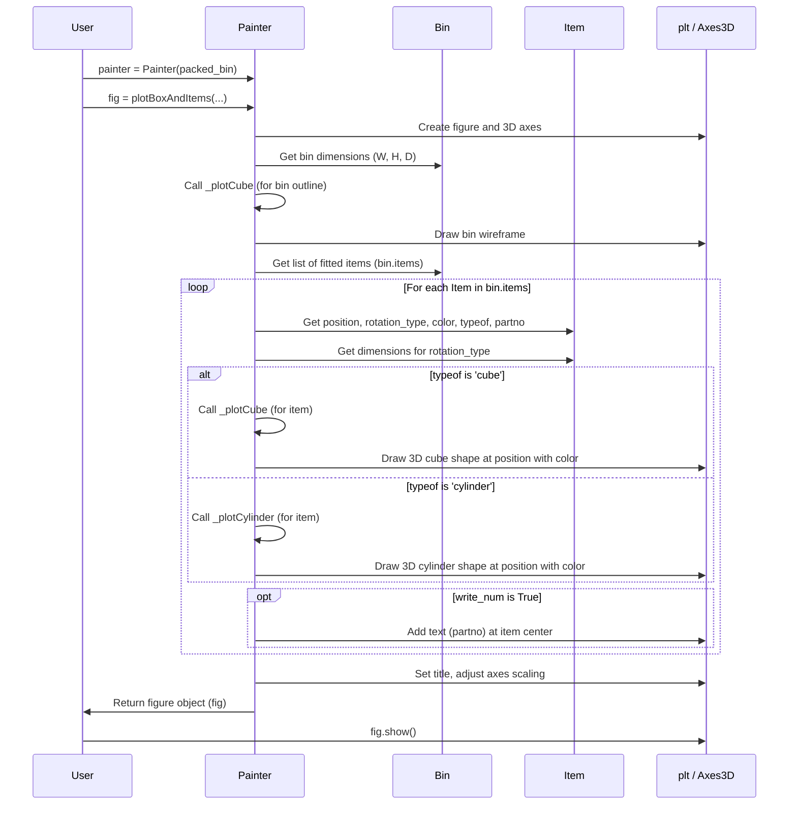

# Chapter 7: Visualization (Painter)

In the previous chapter, [Chapter 6: Item Rotation](06_item_rotation_.md), we explored how the packer can rotate items to find the best fit. After all the calculations, sorting, and placement logic, the `Packer` finishes its job. But how do you actually *see* the result? Trying to understand the packing just by looking at lists of item coordinates (`item.position`) can be really difficult!

Imagine you perfectly packed a real box. Wouldn't you want to take a photo or look inside to admire your work and check if everything looks right? That's exactly what the **Visualization (Painter)** module does for our virtual packing.

## What is the Painter?

The `Painter` is like a camera or a 3D model generator for your packed `Bin`. Its main job is to:

1.  Take a `Bin` object that has already been packed (meaning it has items inside its `items` list).
2.  Use a popular Python plotting library called `matplotlib`.
3.  Generate a 3D plot showing:
    *   The outline of the bin itself.
    *   Each item (`cube` or `cylinder`) placed inside the bin, in its correct position, orientation ([Rotation Type](06_item_rotation_.md)), and assigned color.

This gives you a clear visual representation of the final packing arrangement, making it much easier to understand and verify the results.

## Seeing the Packed Box: Using the Painter

Let's take a simple packing example and see how to visualize it.

1.  **Import necessary classes:** We need `Packer`, `Bin`, `Item`, and now also `Painter`.
2.  **Set up and pack:** Create your packer, bin, and items, and run `packer.pack()`.
3.  **Create a Painter:** Initialize the `Painter` by giving it the *packed* `Bin` object you want to visualize.
4.  **Plot:** Call the `painter.plotBoxAndItems()` method. This creates the plot data.
5.  **Show:** Use `matplotlib`'s standard `show()` function to display the plot window.

Here's the code:

```python
# 1. Import necessary classes
from py3dbp import Packer, Bin, Item, Painter
# We also need matplotlib to show the plot
import matplotlib.pyplot as plt 

# 2. Set up and pack (Example from Chapter 1, slightly modified)
packer = Packer()
box = Bin('MyBox', (10, 10, 10), 100)
packer.addBin(box)

item1 = Item('Item1', 'cube', 'cube', (5, 5, 5), 10, 1, 100, True, 'red')
item2 = Item('Item2', 'cube', 'cube', (5, 5, 5), 10, 1, 100, True, 'blue')
# Add only items that we know will fit
packer.addItem(item1)
packer.addItem(item2)

packer.pack(bigger_first=True, fix_point=True) # Use fix_point for realistic Z placement

# At this point, 'box' contains the fitted items in box.items

# 3. Create a Painter instance for our packed 'box'
painter = Painter(box)

# 4. Generate the plot
# You can customize the plot with options:
fig = painter.plotBoxAndItems(
    title=box.partno,      # Set the plot title (e.g., 'MyBox')
    alpha=0.8,             # Item transparency (0=invisible, 1=opaque)
    write_num=True,        # Write item's partno on the item?
    fontsize=10            # Font size for the part number
)

# 5. Show the plot window
fig.show() 
```

**Explanation:**

*   We import `Painter` from `py3dbp` and `matplotlib.pyplot` as `plt`.
*   We set up and run the packing as usual. The `box` object now holds the results.
*   `painter = Painter(box)` creates the visualizer, linking it to our specific packed bin.
*   `fig = painter.plotBoxAndItems(...)` does the heavy lifting of preparing the 3D plot.
    *   `title`: Sets the window title.
    *   `alpha`: Controls how transparent the items look. Lower values help see items behind others.
    *   `write_num`: If `True`, it tries to write the `item.partno` in the center of each item cube/cylinder. Useful for identifying specific items.
    *   `fontsize`: Controls the size of the text if `write_num` is `True`.
*   `fig.show()`: This is a standard `matplotlib` command that opens a new window displaying the generated 3D plot.

Running this code will open a window showing a wireframe outline of the 10x10x10 bin, with a red 5x5x5 cube and a blue 5x5x5 cube placed inside, likely side-by-side on the bottom (thanks to `fix_point=True`). If `write_num=True`, you'd see "Item1" and "Item2" written on the cubes.

*(See `example1.py`, `example5.py`, and others in the project for more visualization examples).*

## Under the Hood: How the Painter Draws

How does the `Painter` turn the bin and item data into a picture? It uses `matplotlib`'s 3D plotting tools.

**Step-by-Step Flow:**

1.  **Initialization:** When you create `Painter(box)`, it simply stores a reference to the `box` object, giving it access to the bin's dimensions and its list of `items`.
2.  **Plotting Request:** When you call `painter.plotBoxAndItems()`, it starts the drawing process.
3.  **Setup Plot:** It creates a `matplotlib` figure and a special 3D axes object (`Axes3D`) where the drawing will happen.
4.  **Draw Bin:** It calls an internal helper function (`_plotCube`) to draw the wireframe outline of the bin using the `box.width`, `box.height`, and `box.depth`.
5.  **Draw Items:** It then loops through each `item` in the `box.items` list.
    *   For each `item`, it gets its `position` (`[x, y, z]`), `rotation_type`, `color`, and `typeof` ('cube' or 'cylinder').
    *   It calls `item.getDimension()` to find the item's effective width, height, and depth *for its specific rotation*.
    *   Based on `typeof`, it calls the appropriate helper function (`_plotCube` or `_plotCylinder`).
    *   These helper functions use `matplotlib`'s `Rectangle` or `Circle` patches and `art3d` tools to draw the 2D shapes and project them into the correct 3D position and orientation.
    *   If `write_num=True`, it also adds the `item.partno` as text at the item's center.
6.  **Final Touches:** It sets the plot title and adjusts the axes to have equal scaling (so cubes look like cubes, not stretched boxes).
7.  **Return Figure:** It returns the `matplotlib` figure object (`fig`), which you then display using `fig.show()`.

Here's a simplified diagram of the plotting process:



**Code Glimpse:**

The `Painter` class and its helper methods are defined in `py3dbp/main.py`.

1.  **`Painter.__init__()`:** Stores the bin.

    ```python
    # File: py3dbp/main.py (Simplified Painter init)
    class Painter:
        def __init__(self, bins): # Takes a single Bin object
            ''' Store the bin object '''
            # Note: Original code takes 'bins', implying maybe multiple,
            # but examples use it with a single bin. Let's assume one bin.
            # If bins is a list, we might take the first one, or need clarification.
            # Assuming 'bins' is actually a single packed Bin object here for simplicity.
            self.bin = bins # Store the reference to the packed bin
            self.items = bins.items
            self.width = bins.width
            self.height = bins.height
            self.depth = bins.depth
    ```
    *Explanation:* The constructor saves the provided bin object so the Painter knows what to draw.

2.  **`Painter.plotBoxAndItems()`:** Orchestrates the plotting.

    ```python
    # File: py3dbp/main.py (Simplified plotBoxAndItems)
    # Requires imports:
    import matplotlib.pyplot as plt
    import mpl_toolkits.mplot3d.art3d as art3d 
    
    class Painter:
        # ... (__init__) ...

        def plotBoxAndItems(self, title="", alpha=0.2, write_num=False, fontsize=10):
            ''' Plot the Bin and the items it contains. '''
            fig = plt.figure() # Create a matplotlib figure
            axGlob = plt.axes(projection='3d') # Create a 3D axes object

            # Plot the bin outline (using a helper)
            # Use float() to ensure dimensions are numbers
            self._plotCube(axGlob, 0, 0, 0, 
                           float(self.width), float(self.height), float(self.depth),
                           color='black', mode=1, linewidth=2) # mode=1 for wireframe

            # Plot fitted items
            for item in self.items: # Loop through items in the stored bin
                x, y, z = item.position # Get item position
                # Get dimensions based on item's final rotation
                [w, h, d] = item.getDimension() 
                color = item.color
                # Set text to part number if write_num is True, else empty
                text = item.partno if write_num else ""

                # Call specific plotting helper based on item type
                if item.typeof == 'cube':
                    self._plotCube(axGlob, float(x), float(y), float(z), 
                                   float(w), float(h), float(d), 
                                   color=color, mode=2, alpha=alpha, # mode=2 for solid
                                   text=text, fontsize=fontsize)
                elif item.typeof == 'cylinder':
                    self._plotCylinder(axGlob, float(x), float(y), float(z), 
                                       float(w), float(h), float(d), 
                                       color=color, alpha=alpha,
                                       text=text, fontsize=fontsize)

            plt.title(title) # Set the plot title
            self.setAxesEqual(axGlob) # Adjust axes scaling
            return fig # Return the figure object
    ```
    *Explanation:* This method sets up the `matplotlib` environment, draws the bin wireframe, then loops through each fitted item, gets its properties (including rotated dimensions), and calls the appropriate drawing function (`_plotCube` or `_plotCylinder`) before finalizing the plot settings.

3.  **`Painter._plotCube()` and `Painter._plotCylinder()` (Conceptual):** These are helper functions that do the actual drawing using `matplotlib`.

    ```python
    # File: py3dbp/main.py (Conceptual _plotCube)
    from matplotlib.patches import Rectangle
    import mpl_toolkits.mplot3d.art3d as art3d

    class Painter:
        # ... (__init__, plotBoxAndItems) ...

        def _plotCube(self, ax, x, y, z, dx, dy, dz, color='red', mode=2, alpha=0.5, text="", ...):
            if mode == 1: # Wireframe for bin
                # ... (ax.plot3D calls for lines) ...
                pass 
            else: # Solid cube for item
                # Create 6 Rectangle patches for the faces
                p1 = Rectangle((x, y), dx, dy, fc=color, ec='black', alpha=alpha)
                # ... (create p2 to p6 for other faces) ...
                
                # Add patches to the axes
                ax.add_patch(p1)
                # ... (add p2 to p6) ...

                # Use art3d to position the 2D faces in 3D space
                art3d.pathpatch_2d_to_3d(p1, z=z, zdir="z") # Bottom face
                # ... (position other faces) ...

                if text != "":
                    ax.text( (x+dx/2), (y+dy/2), (z+dz/2), str(text), ...) # Add text label
```
    *Explanation:* The helpers take the position (x, y, z), dimensions (dx, dy, dz), color, and other options. They create 2D shapes (`Rectangle` for cubes, `Circle` for cylinder bases) and use `matplotlib`'s `art3d` to place and orient these shapes correctly in the 3D plot.

## Conclusion

The `Painter` class provides an invaluable tool for understanding the output of the `3D-bin-packing` library. By generating a 3D visual representation of the packed bin and its contents using `matplotlib`, it allows you to quickly assess the packing solution, check item placement and orientation, and verify that the packing looks physically reasonable. It turns abstract coordinate data into an intuitive picture.

Now that we've covered the core components – the engine, items, bins, algorithms, constraints, rotation, and visualization – how do you easily integrate this library into your own applications? The next chapter explores the common ways to interact with the packer through its API.

Next: [Chapter 8: API Interface](08_api_interface_.md)

---

Generated by [AI Codebase Knowledge Builder](https://github.com/The-Pocket/Tutorial-Codebase-Knowledge)