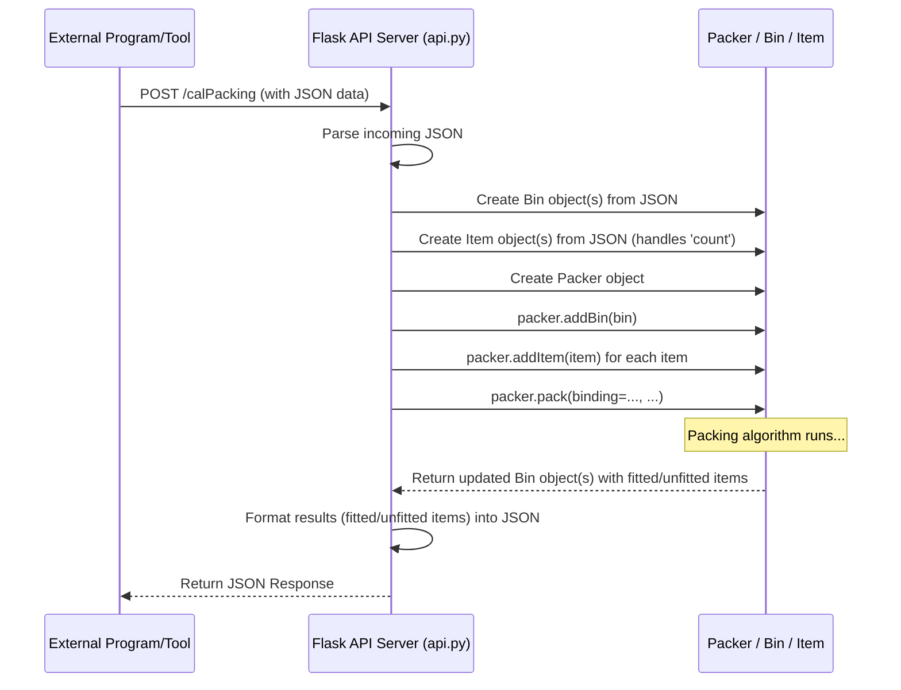

# Chapter 8: API Interface

Welcome to the final chapter! In [Chapter 7: Visualization (Painter)](07_visualization__painter__.md), we saw how to create a 3D picture of our packed bin using the `Painter`. This is great when *we* are running the Python script directly. But what if you want to let *other* programs or even a website use the packing engine without running the Python code themselves?

Imagine you built a fantastic website for a shipping company. Users should be able to enter the dimensions and weights of their items, click a button, and see how they fit into a container. How does the website *ask* our `3D-bin-packing` library to perform the calculation? This is where an **API Interface** comes in handy.

## What is an API?

**API** stands for **Application Programming Interface**. That sounds technical, but the idea is simple. Think of it like a **remote control** for a service, or a **menu at a restaurant**.

*   **Remote Control:** You don't need to know how the TV works internally to change the channel. You just press the buttons on the remote (the API), and the TV (the service) responds.
*   **Restaurant Menu:** You don't need to know how the kitchen works. You look at the menu (the API), choose what you want (make a request), give your order to the waiter (send the request), and the kitchen (the service) prepares your food and sends it back.

An API defines a way for different software programs to talk to each other, make requests, and get responses, usually following a set of predefined rules and formats.

## Why an API for 3D Bin Packing?

The `3D-bin-packing` library includes an optional API layer built using **Flask**, a popular Python web framework. This API layer turns the packing library into a **web service**.

Why is this useful?

1.  **Decoupling:** Your website frontend (built with HTML, JavaScript, etc.) doesn't need to contain the complex Python packing logic. It just needs to know how to send a request to the API's URL.
2.  **Language Independence:** Any programming language or tool that can make web requests (like JavaScript in a browser, another Python script, Java, PHP, `curl` command line tool, Postman) can use the packing engine via the API.
3.  **Centralization:** You can run the packing service on one server, and multiple different applications or users can access it.

The API acts like an order form for the packing service. Other programs fill out the form (with bin and item details in a specific format) and send it to the API's address. The API then uses the [Packer Engine](01_packer_engine_.md) to process the order and sends the results back.

## How it Works: The `3D-bin-packing` API

The API in this project uses a simple web server created with Flask. Here's the basic flow:

1.  **Run the API Server:** You start a Python script (`api.py`) that runs the Flask web server. This server listens for incoming web requests on a specific network address and port (e.g., `http://localhost:5050`).
2.  **Define Endpoints:** The server defines specific URL paths, called **endpoints**, that trigger actions. The main endpoint in this project is `/calPacking`.
3.  **Client Sends Request:** Another program (the "client") sends an HTTP request (usually a `POST` request) to the server's endpoint (e.g., `http://localhost:5050/calPacking`). This request includes the necessary data, like bin dimensions and a list of items to pack.
4.  **JSON Data Format:** The data sent in the request and received in the response is typically formatted using **JSON** (JavaScript Object Notation). JSON is a human-readable text format that uses key-value pairs, much like Python dictionaries.

    *   *Example JSON Input (Simplified):*
        ```json
        {
          "box": { "name": "MyBin", "WHD": [50, 40, 30], "max_weight": 100 },
          "items": [
            { "name": "ItemA", "WHD": [10, 10, 10], "weight": 5, "count": 2 },
            { "name": "ItemB", "WHD": [20, 15, 10], "weight": 12, "count": 1 }
          ]
        }
        ```
5.  **Server Processes Request:**
    *   The Flask server receives the request at the `/calPacking` endpoint.
    *   It parses the incoming JSON data.
    *   It creates `Bin` and `Item` objects based on the received data (using the concepts from [Chapter 2: Item Representation](02_item_representation_.md) and [Chapter 3: Bin Representation](03_bin_representation_.md)).
    *   It creates a `Packer` instance and adds the bins and items.
    *   It calls `packer.pack()` to perform the calculation, potentially using constraints discussed in [Chapter 5: Packing Constraints & Features](05_packing_constraints___features_.md).
6.  **Server Sends Response:**
    *   Once packing is complete, the server gathers the results (which items fit, which didn't, their positions, rotations from [Chapter 6: Item Rotation](06_item_rotation_.md), etc.).
    *   It formats these results into JSON.
    *   It sends this JSON data back to the client as the HTTP response.

    *   *Example JSON Output (Simplified):*
        ```json
        {
          "Success": true,
          "data": {
            "box": { "partNumber": "MyBin", "WHD": [50, 40, 30], ... },
            "fitItem": [
              { "partNumber": "ItemA-1", "position": [0, 0, 0], "rotationType": 0, ... },
              { "partNumber": "ItemA-2", "position": [10, 0, 0], "rotationType": 0, ... },
              { "partNumber": "ItemB-1", "position": [0, 10, 0], "rotationType": 0, ... }
            ],
            "unfitItem": []
          }
        }
        ```
7.  **Client Uses Response:** The client program receives the JSON response and can then use the data (e.g., display the packing results, show a 3D visualization perhaps using the coordinates).

## Using the API: Example `/calPacking`

The main workhorse of the provided API is the `/calPacking` endpoint. To use it, you typically need a tool or code that can send HTTP POST requests (like `curl`, Postman, or JavaScript's `fetch` API).

**1. Prepare the Input Data (JSON):**
You need to structure your bin and item information according to the format expected by the API. Based on the `api.md` file, a simplified input looks like this:

```json
{
    "box": [
        {
            "name": "StandardContainer",
            "WHD" : [580, 240, 250],  
            "weight": 25000,        
            "coner": 10,            
            "openTop": [1]          
        }
    ],
    "item": [
        {
            "name":"LargeBox",
            "WHD" : [100, 80, 60],   
            "count": 5,             
            "updown": 1,            
            "type": 1,              
            "level": 1,             
            "loadbear": 50,         
            "weight": 75,           
            "color" : 1             
        },
        {
            "name":"SmallCube",
            "WHD" : [30, 30, 30],
            "count": 20,
            "updown": 1,
            "type": 1,
            "level": 1,
            "loadbear": 10,
            "weight": 10,
            "color" : 2
        }
    ],
    "binding" : [] 
}
```
*   `box`: A list containing one or more bin definitions.
    *   `name`: Bin identifier.
    *   `WHD`: Width, Height, Depth list.
    *   `weight`: Maximum weight capacity.
    *   `coner`: Corner reservation size (see [Chapter 5](05_packing_constraints___features_.md)).
    *   `openTop`: List, usually `[1]` for standard side loading.
*   `item`: A list of item types to pack.
    *   `name`: Item type identifier.
    *   `WHD`: Width, Height, Depth list.
    *   `count`: How many of this item type to pack.
    *   `updown`: 1 for True (can flip), 0 for False (see [Chapter 6](06_item_rotation_.md)).
    *   `type`: 1 for 'cube', 2 for 'cylinder'.
    *   `level`: Packing priority (see [Chapter 5](05_packing_constraints___features_.md)).
    *   `loadbear`: Load bearing capacity (see [Chapter 5](05_packing_constraints___features_.md)).
    *   `weight`: Weight of one item.
    *   `color`: A number for basic color assignment (used internally).
*   `binding`: List of groups of item names to keep together (see [Chapter 5](05_packing_constraints___features_.md)).

**2. Send the Request:**
Using a tool like `curl` from your command line (assuming the API server is running on your local machine at port 5050):

```bash
curl -X POST http://localhost:5050/calPacking \
     -H "Content-Type: application/json" \
     -d '{ "box": [ { "name": "StandardContainer", "WHD": [580, 240, 250], "weight": 25000, "coner": 10, "openTop": [1] } ], "item": [ { "name": "LargeBox", "WHD": [100, 80, 60], "count": 5, "updown": 1, "type": 1, "level": 1, "loadbear": 50, "weight": 75, "color": 1 }, { "name": "SmallCube", "WHD": [30, 30, 30], "count": 20, "updown": 1, "type": 1, "level": 1, "loadbear": 10, "weight": 10, "color": 2 } ], "binding": [] }'
```
*(Note: The `-d` argument contains the JSON data. You might put the JSON in a file and use `-d @filename.json` for cleaner requests.)*

**3. Receive the Response (JSON):**
The server will process the packing request and send back a JSON response similar to this (simplified):

```json
{
    "Success": true,
    "data": {
        "box": [
            {
                "partNumber": "StandardContainer",
                "WHD": [ 580, 240, 250 ],
                "position": [ 290.0, 120.0, 125.0 ], 
                "weight": 25000,
                "gravity": [ ... ] 
            }
        ],
        "fitItem": [
            {
                "partNumber": "LargeBox-1",
                "name": "LargeBox",
                "type": "cube",
                "color": "#FF0000", 
                "position": [ 50, 40, 30 ], 
                "rotationType": 0,
                "WHD": [ 100, 80, 60 ],
                "weight": 75
            },
            {
                "partNumber": "SmallCube-1",
                "name": "SmallCube",
                "type": "cube",
                "color": "#FFFF00",
                "position": [ 15, 15, 90 ],
                "rotationType": 0,
                "WHD": [ 30, 30, 30 ],
                "weight": 10
            } 
            
        ],
        "unfitItem": [
            
        ]
    }
}
```
*   `Success`: Indicates if the API call itself was successful (doesn't mean all items fit).
*   `data`: Contains the results.
    *   `box`: Information about the bin used.
    *   `fitItem`: A list of items that were successfully packed, including their unique `partNumber` (name + count), position, rotation, etc.
    *   `unfitItem`: A list of items that could not be packed.

Your client application would parse this JSON to understand the packing results.

## Under the Hood: Code Walkthrough

Let's peek inside the `api.py` file to see how Flask handles the `/calPacking` request and interacts with the `Packer`.

**Sequence Diagram:**



**Code Glimpse (`api.py`):**

1.  **Flask App Setup:** Initialize the Flask web application.

    ```python
    # File: api.py
    import flask
    import json
    # Import the necessary classes from our library
    from py3dbp import Packer, Bin, Item 
    from flask_cors import cross_origin # For handling web browser security

    # Initialize Flask
    app = flask.Flask(__name__) 
    ```
    *Explanation:* This sets up the basic Flask server application.

2.  **`/calPacking` Endpoint Definition:** Define the function that handles requests to `/calPacking`.

    ```python
    # File: api.py (continued)

    # Define the route for packing calculation, only allow POST requests
    @app.route("/calPacking", methods=["POST"])
    @cross_origin() # Allows requests from web pages hosted elsewhere
    def mkResultAPI():
        ''' Handles packing calculation requests. '''
        res = {"Success": False} # Default response assumes failure

        # Get the raw data sent by the client
        # Use flask.request.get_json() for better JSON handling
        try:
            q = flask.request.get_json() 
            if not q:
                # Handle case where no JSON data is sent or content type isn't right
                raise ValueError("Invalid JSON input")
        except Exception as e:
             res["Reason"] = f"Failed to parse JSON input: {e}"
             return flask.jsonify(res)

        # Check if required keys are in the JSON data
        if 'box' in q and 'item' in q:
            try:
                # --- 1. Convert JSON to Packer objects ---
                # Use a helper function (simplified view)
                packer, bin_list, binding = convert_json_to_packer_objects(q) 

                # --- 2. Perform Packing ---
                # Call the packer engine from Chapter 1
                packer.pack(
                    bigger_first=True, 
                    distribute_items=False, # Usually False for single bin API calls
                    fix_point=True,         # Use gravity
                    binding=binding,
                    number_of_decimals=0
                )

                # Assume we packed into the first bin provided
                packed_bin = packer.bins[0] 

                # --- 3. Convert Packer results back to JSON ---
                # Use helper functions (simplified view)
                box_result_json = format_bin_to_json(packed_bin)
                fitted_items_json = [format_item_to_json(item) for item in packed_bin.items]
                unfitted_items_json = [format_item_to_json(item) for item in packed_bin.unfitted_items]
                
                # Prepare successful response
                res["Success"] = True
                res["data"] = {
                    "box": box_result_json,
                    "fitItem": fitted_items_json,
                    "unfitItem": unfitted_items_json
                }

            except Exception as e:
                # Catch errors during packing or conversion
                res["Reason"] = f"Error during processing: {e}"
        
        else:
            res['Reason'] = 'Required keys "box" or "item" not in input JSON'

        # Return the final response as JSON
        return flask.jsonify(res) 
    ```
    *Explanation:* This function is triggered when a POST request hits `/calPacking`. It parses the incoming JSON (`get_json()`), uses helper functions (like `convert_json_to_packer_objects`) to set up the `Packer`, `Bin`, and `Item` objects, calls `packer.pack()`, then uses other helpers (like `format_bin_to_json`, `format_item_to_json`) to structure the results back into JSON format before sending the response using `flask.jsonify()`. Error handling is included to provide informative failure reasons.

3.  **Helper Functions (Conceptual):** The actual `api.py` has helper functions like `getBoxAndItem` (renamed `convert_json_to_packer_objects` conceptually above) and `makeDictBox`/`makeDictItem` (renamed `format_bin_to_json`/`format_item_to_json` conceptually above).

    *   `convert_json_to_packer_objects(json_data)`: Would take the input JSON dictionary, create the `Packer`, loop through `json_data['box']` to create `Bin` objects, loop through `json_data['item']` to create `Item` objects (multiplying by `count`), add them to the packer, and parse the `binding` list.
    *   `format_bin_to_json(bin_object)`: Would take a `Bin` object and create a dictionary/list suitable for the JSON response (including `partNumber`, `WHD`, etc.).
    *   `format_item_to_json(item_object)`: Would take an `Item` object (either fitted or unfitted) and create a dictionary for the JSON response, calculating the correct position and dimensions based on `rotation_type`.

4.  **Running the Server:** The end of `api.py` starts the Flask development server.

    ```python
    # File: api.py (end of file)

    # Helper functions (convert_json_to_packer_objects, format_bin_to_json, etc.)
    # ... (would be defined here) ...

    if __name__ == "__main__":
        # Start the Flask web server
        # host='0.0.0.0' makes it accessible from other machines on the network
        # port=5050 is the port number it listens on
        # debug=True provides more error details during development
        print("* Starting Flask web service...")
        app.run(host='0.0.0.0', port=5050, debug=True)
    ```
    *Explanation:* When you run `python api.py`, this section starts the Flask server, making the `/calPacking` endpoint available for requests.

## Conclusion

The API Interface provides a powerful way to interact with the `3D-bin-packing` library remotely. By running the Flask web server (`api.py`), you expose the packing functionality as a web service. Other applications, websites, or tools can then send packing requests (containing bin and item data in JSON format) to the `/calPacking` endpoint and receive the packing results (fitted and unfitted items) back as JSON. This enables seamless integration of the packing engine into larger systems without requiring direct use of the Python library code.

This chapter concludes our journey through the core concepts of the `3D-bin-packing` library. We hope this tutorial has given you a solid foundation for understanding and using this tool!

---

Generated by [AI Codebase Knowledge Builder](https://github.com/The-Pocket/Tutorial-Codebase-Knowledge)