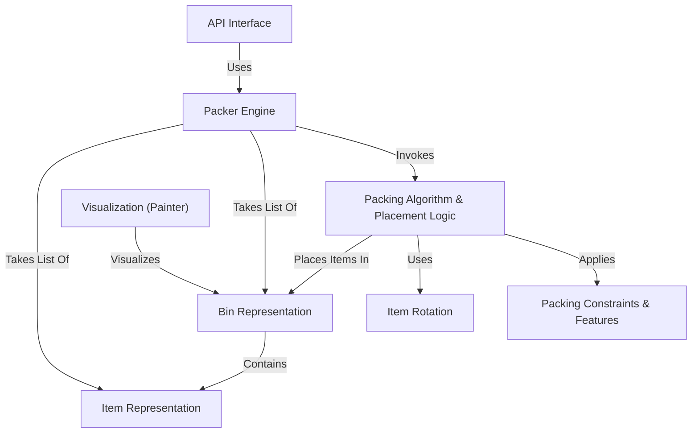

# Tutorial: 3D-bin-packing

This project provides a Python library for solving the **3D Bin Packing Problem**.
It calculates how to efficiently fit a list of *3D items* (like boxes or cylinders) into one or more *bins* (containers).
The main **Packer Engine** uses a specific *packing algorithm* and considers various *constraints* like item rotation, stability, and weight limits.
It also includes features for *visualization* to show the packed bins and an *API* to use the packing functionality through a web service.

**Source Repository:** [None](None)

## Chapters

1. [Packer Engine
](01_packer_engine_.md)
2. [Item Representation
](02_item_representation_.md)
3. [Bin Representation
](03_bin_representation_.md)
4. [Packing Algorithm & Placement Logic
](04_packing_algorithm___placement_logic_.md)
5. [Packing Constraints & Features
](05_packing_constraints___features_.md)
6. [Item Rotation
](06_item_rotation_.md)
7. [Visualization (Painter)
](07_visualization__painter__.md)
8. [API Interface
](08_api_interface_.md)

---

Generated by [AI Codebase Knowledge Builder](https://github.com/The-Pocket/Tutorial-Codebase-Knowledge)